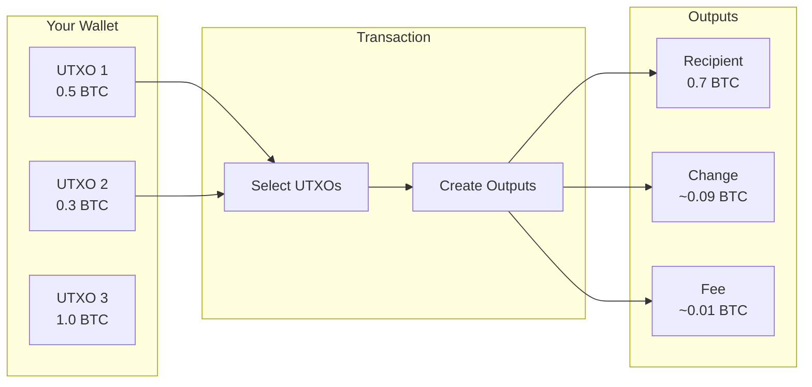
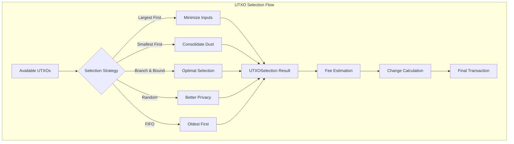

# kotlin-utxo

<p align="center">
  
</p>

<p align="center">
  <a href="https://jitpack.io/#ImL1s/kotlin-utxo"></a>
  <a href="#"></a>
  <a href="#"></a>
  <a href="#"></a>
</p>

<p align="center">
  <strong>₿ Pure Kotlin UTXO management for Bitcoin and UTXO-based blockchains.</strong>
</p>

<p align="center">
  Optimal coin selection, fee estimation, and transaction building<br>
  designed for <strong>wearables</strong> and mobile.
</p>

---

## 🪙 What is UTXO?

Unlike account-based systems (Ethereum), Bitcoin uses the **UTXO (Unspent Transaction Output)** model:



This library handles the complexity of UTXO selection automatically.

---

## ✨ Features

| Feature | Description |
|---------|-------------|
| **5 Selection Strategies** | Largest-first, smallest-first, branch-and-bound, random, FIFO |
| **Accurate Fee Estimation** | Virtual byte calculation for SegWit |
| **Dust Protection** | Automatic filtering of uneconomical UTXOs |
| **Confirmation Control** | Filter by confirmation count |
| **Pure Kotlin** | No native dependencies |
| **Wearable-Ready** | Optimized for watchOS and Wear OS |

---

## 🏗️ Architecture



---

## 🎯 Supported Platforms

| Platform | Target | Status |
|----------|--------|--------|
| **Android** | `androidTarget` | ✅ |
| **iOS** | `iosArm64`, `iosSimulatorArm64`, `iosX64` | ✅ |
| **watchOS** | `watchosArm64`, `watchosSimulatorArm64` | ✅ |
| **JVM** | `jvm` | ✅ |

---

## 📦 Installation

```kotlin
// build.gradle.kts
implementation("com.github.ImL1s:kotlin-utxo:0.4.0-watchos")
```

---

## 🚀 Quick Start

### Basic UTXO Selection

```kotlin
import io.github.iml1s.utxo.*

// Create available UTXOs
val utxos = listOf(
    UTXO(txid = "abc123...", vout = 0, value = 50_000, confirmed = true),
    UTXO(txid = "def456...", vout = 1, value = 30_000, confirmed = true),
    UTXO(txid = "ghi789...", vout = 0, value = 100_000, confirmed = true)
)

// Select UTXOs for transaction
val selector = UTXOSelector()
val selection = selector.select(
    utxos = utxos,
    targetAmount = 70_000,  // satoshis
    feeRate = 10            // sat/vB
)

println("Selected: ${selection.inputCount} UTXOs")
```

---

## 📄 License
MIT License
